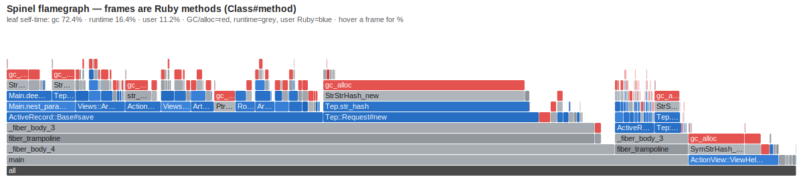

# spinel-dev

Developer-experience tooling for [Spinel](https://github.com/matz/spinel), the
whole-program Ruby → C AOT compiler — plus the design notes (RFC / discussion)
that motivated it.

> **Status.** This repo began as analysis — *can Ruby tooling work at all against
> a closed-world, no-VM, no-`eval` compiler?* That question is now answered by
> **working tools**, below, and the compiler-side hooks they need have **all
> merged upstream** in [`matz/spinel`](https://github.com/matz/spinel) — landed one
> PR at a time (`--emit-rbs`, `--debug`, `--emit-types`, native backtrace — see
> [Compiler surfaces](#compiler-surfaces-upstreaming)). Everything is opt-in /
> debug-gated; non-debug release output is byte-for-byte unchanged. The design
> docs remain as the rationale and open-discussion surface — treat them as RFCs.

## The tools

Each is runnable today. The standalone tools live in [`tools/`](tools/); the
compiler flags now all ship in `matz/spinel` (`--emit-rbs`, `--debug`,
`--emit-types`, native backtrace — see [Compiler surfaces](#compiler-surfaces-upstreaming)).
Jump to [Getting started](#getting-started) for hands-on usage.

### `spinel doctor` — one-shot health check
[`tools/doctor/`](tools/doctor/) · `doctor.sh [--json] [--no-bisect] <program.rb>`

Six escalating checks in one command: an **ignored `require`** (the prime suspect
for an emit-0 cascade — a wrong path silently unloads a whole module), the
**compile** probe (calls that emit `0`), the **inference** scan (methods widened
to `untyped`), an **inference↔codegen disagreement** (inference resolves a method
but codegen emits-0 — the static silent-miscompile fingerprint), a **codegen**
build check (`cc -c` the emitted C — catches what analysis misses, like a Class
boxed as int), and the **behavior** diff vs CRuby. Verdict from `clean` to
`codegen-error`. Human or `--json`. `doctor-gate` wraps it for CI: an allowlist
of known degrades, non-zero exit on a *new* degrade, a disagreement, a codegen
error, or a miscompile.

### `spinel-reduce` / `spinel-flatten` — minimal repro from a degrade
[`tools/reduce/`](tools/reduce/) · `spinel-reduce.rb [--target SUBSTR] <degrading.rb>`

Delta-debugs a degrading program to its **minimal trigger** (ddmin with `doctor
--json` as the oracle): keep removing code while the target finding still
reproduces; what survives is the cause. `spinel-flatten` inlines a gem's
`require_relative` graph into one file first, so `spinel-flatten smoke.rb | …`
turns a real gem's failing smoke into a minimal bug report automatically.

### value-bisect — differential value localization
[`tools/value-bisect/`](tools/value-bisect/) · `bisect.sh [--json] <program.rb>`

Runs a program under CRuby (the oracle) and as a Spinel `--debug` binary,
traces the change-history of every scalar local on both sides, and reports the
first `(file, line, variable)` whose value diverges — pinpointing a **silent
miscompile**, the failure mode `spinelgems` calls the dangerous one. Multi-file
(`require_relative` chains traced too). `triage.sh --failing` localizes every
test-suite failure the same way. Consumed by `spinelgems verify` to upgrade a
"the outputs differ" verdict into a line to look at.

### ruby-lsp-spinel — inferred types in the editor
[`tools/ruby-lsp-spinel/`](tools/ruby-lsp-spinel/)

A ruby-lsp addon that surfaces Spinel's per-node type inference on hover, and
flags where a type degraded to the boxed poly slow path — directly attacking the
silent-miscompile problem at authoring time.

### performance analysis — *would it be faster? why is it slow?*
[`tools/perf/`](tools/perf/)

The same inference + `#line` substrate, turned on speed. `speedup-estimate`
scores a program's `untyped`/poly density (the static "should I port this gem?"
gate); `spinel-perf` profiles a `-pg` build and maps hot frames back to Ruby
lines with a **GC-vs-user self-time split**; `rbs-disagree` finds positions where
the compiler's inference disagrees with a consumer's (a candidate-bug localizer —
[it found one](https://github.com/matz/spinel/pull/1330)). And `spinel-flamegraph`
renders the call hierarchy with frames demangled to `Class#method`:



That's an AOT-compiled Rails blog under load. The flame is ~72% red at the
leaves: every hot path (`Tep::Request#new`, `ActiveRecord::Base#save`,
`ActionView::ViewHelpers.*`) bottoms out in `sp_gc_alloc`. The win over CRuby is
real but capped at ~1.5–1.9× here — because this workload is **allocation-bound,
not boxing-bound**, a decomposition the flamegraph makes legible at a glance.
Write-up: [docs/08](docs/08-perf-analysis.md), discussion on
[spinel-dev#5](https://github.com/OriPekelman/spinel-dev/issues/5)/[#7](https://github.com/OriPekelman/spinel-dev/issues/7).

## Getting started

You need a built `spinel` (the AOT compiler). Point the standalone tools at it
with `SPINEL_DIR` (defaults to `~/sites/spinel`). The bisector also needs
`python3` + `lldb`.

```sh
git clone https://github.com/matz/spinel && cd spinel && make all   # or your checkout
export SPINEL_DIR=$PWD
git clone https://github.com/OriPekelman/spinel-dev && cd spinel-dev
```

**1 — "Is my program safe to compile?"** Run the one-shot health check:

```sh
sh tools/doctor/doctor.sh app.rb
#  compile    ⚠ 1 unresolved call(s) — Spinel silently emits 0:
#               - cannot resolve call to 'delete_at' on float_array (emitting 0)
#  inference  ⚠ 3 method(s) widened to untyped (slow path / inference gap)
#  behavior   ✓ matches CRuby (value-bisection)
#  verdict    degrades
```

`--json` for CI/agents. `--no-cruby` for FFI/AOT-only apps that can't run under
CRuby (reports `ran`/`crash` from the Spinel side alone).

**2 — "It compiled but the output is wrong. Where?"** Localize the divergence:

```sh
sh tools/value-bisect/bisect.sh app.rb
#  [MISCMP] x @ app.rb:12   CRuby=9223372036854775808  Spinel=-9223372036854775808
```

It traces every scalar/string/array/hash/bignum local under CRuby and a Spinel
`--debug` build and reports the first to diverge — or `output-differ` when the
wrong value never lands in a local. `triage.sh --failing` does this for a whole
failing test suite.

**3 — "What did the compiler infer?"**

```sh
spinel app.rb --emit-rbs                 # app.rbs — signatures (untyped = slow path)
spinel app.rb --emit-types -o t.json     # per-position {file,line,col,type} + degrade diagnostics
```

**4 — "Step through the compiled binary."**

```sh
spinel app.rb --debug -o app && gdb ./app    # break app.rb:42 ; step ; bt  → Ruby lines
```

**5 — "In my editor."** Install [`tools/ruby-lsp-spinel`](tools/ruby-lsp-spinel/)
as a ruby-lsp addon for inferred types on hover + degrade underlines.

Per-tool detail lives in each tool's README; the agentic/CI patterns are in
[docs/03](docs/03-tooling-for-contributors-and-agents.md).

### Compiler surfaces (upstreaming)

The tools rely on a few opt-in, output-neutral compiler hooks. These landed in
`matz/spinel` one reviewable PR at a time — **all now merged**:

- **`spinel --emit-rbs`** — whole-program inference exported as RBS signatures.
  ✅ **Merged** ([matz/spinel#1276](https://github.com/matz/spinel/pull/1276)).
- **`spinel --debug` / `-g`** — `#line` directives for native-debugger (lldb/gdb)
  stepping through Ruby source + non-inlined methods. ✅ **Merged**
  ([matz/spinel#1292](https://github.com/matz/spinel/pull/1292)).
- **`spinel --emit-types`** — the same inference as position-keyed JSON (what the
  LSP consumes). ✅ **Merged** ([matz/spinel#1298](https://github.com/matz/spinel/pull/1298)).
- **native `Exception#backtrace` / `Kernel#caller`** (macOS + Linux) ✅ **Merged**
  ([matz/spinel#1300](https://github.com/matz/spinel/pull/1300)), plus FloatArray
  `delete_at`/`join` ([#1301](https://github.com/matz/spinel/pull/1301)) and a
  debug-only **null-receiver guard** (`NoMethodError` instead of a silent NULL deref).

## Design docs (RFC / discussion)

| Doc | What it covers |
|---|---|
| [00-architecture-constraints](docs/00-architecture-constraints.md) | The Spinel design facts that govern every answer below. Read first. |
| [01-debuggability](docs/01-debuggability.md) | Can byebug/pry work? An "auto LSP"? What works today, what's cheap, what's structurally impossible. |
| [02-compile-gems-reverse-cext](docs/02-compile-gems-reverse-cext.md) | Could Spinel compile Ruby *into a CRuby C-extension* — keep interpreted Ruby as the workhorse? Feasibility + the v1 target. |
| [03-tooling-for-contributors-and-agents](docs/03-tooling-for-contributors-and-agents.md) | Operator's manual for the tools above: proof-of-value runs, the agentic dev loop, the upstreaming rationale. |
| [04-tooling-for-developers](docs/04-tooling-for-developers.md) | Gem-author / app-developer how-to: check a binary matches CRuby, debug + backtrace, read inferred types. |
| [05-tooling-surfaces-and-roadmap](docs/05-tooling-surfaces-and-roadmap.md) | Gap analysis — which surfaces (CI, terminal, IDE/DAP, type-checker, packaging) are still needed, in suggested order. |
| [06-validation-results](docs/06-validation-results.md) | Evidence the tools are valuable: `--emit-rbs` vs tep's authored RBS (~73% agreement), `doctor` on toy (real emit-0 + degrades), and the limitations both expose. |
| [07-packaging](docs/07-packaging.md) | How the tools ship: compiler features upstream, harness as three small gems (`ruby-lsp-spinel`, `spinel-bisect`, `spinel-doctor`). Proposal; unpublished pending upstream merge. |
| [08-perf-analysis](docs/08-perf-analysis.md) | Proposal: "would Spinel make you faster?" (static degrade-scan estimate) + "why slow?" (a profiler over the `#line` map). Reuses the inference + source-map substrate. |

## Sibling projects

- **[matz/spinel](https://github.com/matz/spinel)** — the AOT compiler
  (`spinel_parse` → `spinel_analyze` → `spinel_codegen` → C → native). Self-hosting;
  whole-program inference; native C value model (no `VALUE`, no VM, no `eval`).
- **[spinelgems](https://github.com/OriPekelman/spinelgems)** (`bundler-spinel`) —
  dependency gating + the vendor flow that links C extensions *into* a Spinel
  binary, plus the `verified` differential harness (which calls value-bisect).
- **[tep](https://github.com/OriPekelman/tep)** — Sinatra-flavoured web framework
  compiled through Spinel; the largest real-world Spinel app and a codegen
  torture test.
- **[toy](https://github.com/OriPekelman/toy)** — pure-Ruby ML framework compiled
  by Spinel (Tep's downstream consumer).

## Why this is cheap in Spinel

Spinel's design — closed-world, no VM, no `VALUE`, native-typed locals, no `eval`
— rules out runtime debuggers and a live REPL, but makes the opposite cheap: the
compiler *already* computes a whole-program type for every node and (under
`--debug`) a `#line` map back to Ruby. The tools just surface that. The specific
hooks — source-mapped debug builds, inference export (RBS / JSON), native
backtraces — are listed with their upstreaming status under
[Compiler surfaces](#compiler-surfaces-upstreaming); the design rationale is in
[docs 00–01](docs/00-architecture-constraints.md).

*One load-bearing caveat:* `#line` directives perturb DWARF variable-location
info, so a debugger misreads *locals* in functions with heap locals — stepping
and the line table are correct. value-bisect sidesteps it by tracing a
`#line`-free build and mapping C lines back.

The throughline: every capability is **opt-in and observability-only** — it
exposes what the compiler already knows or adds a debug-gated build mode, and
never changes the semantics or the byte-for-byte output of a release build.
